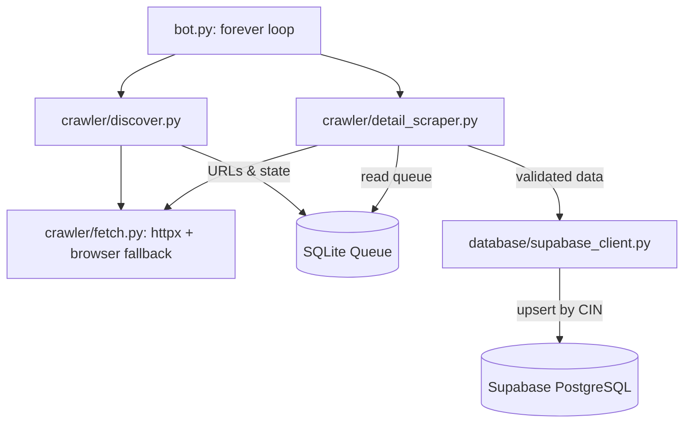

# Technical Documentation: Zauba Corp Continuous Ingestion System

## 1. Overview
The Zauba Corp Ingestion Bot is a continuous ingestion system that discovers,
scrapes, validates, and synchronizes the **newest companies** listed on
[ZaubaCorp](https://www.zaubacorp.com) into a Supabase PostgreSQL backend. It is
built to run unattended on a VPS forever and recover from every error on its
own.

### Core Technical Stack
*   **Networking:** `httpx` (synchronous) with a Playwright browser fallback
*   **Parsing:** `BeautifulSoup4` (LXML backend)
*   **State Queue:** `SQLite3` (discovery queue, retry tracking, dedup)
*   **Primary Database:** `Supabase PostgreSQL` (company storage)
*   **Analysis:** `Pandas` (CSV export)

---

## 2. How "latest companies" works

ZaubaCorp has **no public "newest companies" page**. Its master list
(`/companies-list/p-N-company.html`) is sorted by industry code and company
name — *not* by date — so crawling it returns companies of every age at random.

Instead, the bot crawls ZaubaCorp's **age bucket `age-A`**, which is the
*youngest* companies the site indexes:

```
Page 1 : https://www.zaubacorp.com/companies-list/age-A-company.html
Page N : https://www.zaubacorp.com/companies-list/age-A/p-N-company.html
```

This bucket is currently ~496 pages (~14,900 companies). It is the freshest
data ZaubaCorp publishes. Every company in it is scraped and stored — there is
**no incorporation-date filter** (the old 30-day filter dropped everything,
because ZaubaCorp has nothing from the last 30 days).

To read the data **latest → oldest**, query Supabase ordered by date:

```sql
SELECT * FROM companies ORDER BY incorporation_date DESC NULLS LAST;
```

---

## 3. System Architecture



### Module Responsibilities
- **`bot.py`** — forever loop: sweeps the bucket, recovers from any error with
  exponential backoff, never exits on failure.
- **`crawler/discover.py`** — crawls the `age-A` bucket, finds the live page
  count, queues every company URL.
- **`crawler/fetch.py`** — single resilient fetcher: httpx with retries, then a
  Playwright browser fallback when Cloudflare blocks, then a cooldown.
- **`crawler/detail_scraper.py`** — parses each company page (JSON-LD first,
  HTML-table fallback), validates it, stores it.
- **`database/db.py`** — SQLite work queue; a URL is "done" once `synced=1`.
- **`database/supabase_client.py`** — Supabase upsert with retries.

---

## 4. Resilience (unattended VPS operation)

* **Self-healing loop** — every exception is caught; the bot backs off
  (60s, doubling up to 30min) and retries. It never dies.
* **Cloudflare handling** — blocked requests retry, then fall back to a real
  browser; persistent blocking triggers a 15-minute cooldown.
* **Retry queue** — failed URLs are retried across sweeps up to
  `MAX_URL_ATTEMPTS` times, then abandoned.
* **Crash resilience** — a `systemd` service and a `run_forever.sh` wrapper
  both restart the process if it ever exits.
* **Log rotation** — `logs/scraper.log` is capped (5 MB × 5 files) so the disk
  never fills.

---

## 5. Setup & Usage

### Prerequisites
1. Create a `.env` file based on `.env.example`:
   ```
   SUPABASE_URL="your-supabase-project-url"
   SUPABASE_KEY="your-supabase-service-role-key"
   ```
2. Run the SQL in `supabase_schema.sql` in the Supabase dashboard.
3. Install dependencies: `pip install -r requirements.txt`
   (and `playwright install chromium` for the browser fallback).

### Run it

```bash
python bot.py          # run forever
python bot.py --once   # one sweep then exit (testing)
```

### Keep it running on a VPS

**Option A — systemd (recommended, auto-starts on reboot):**
```bash
sudo cp zauba-scraper.service /etc/systemd/system/
sudo systemctl daemon-reload
sudo systemctl enable --now zauba-scraper
journalctl -u zauba-scraper -f      # watch logs
```

**Option B — bash wrapper (no root needed):**
```bash
chmod +x run_forever.sh
nohup ./run_forever.sh &
```
Add a `@reboot` crontab entry (see the comments in `run_forever.sh`) to also
survive reboots.
